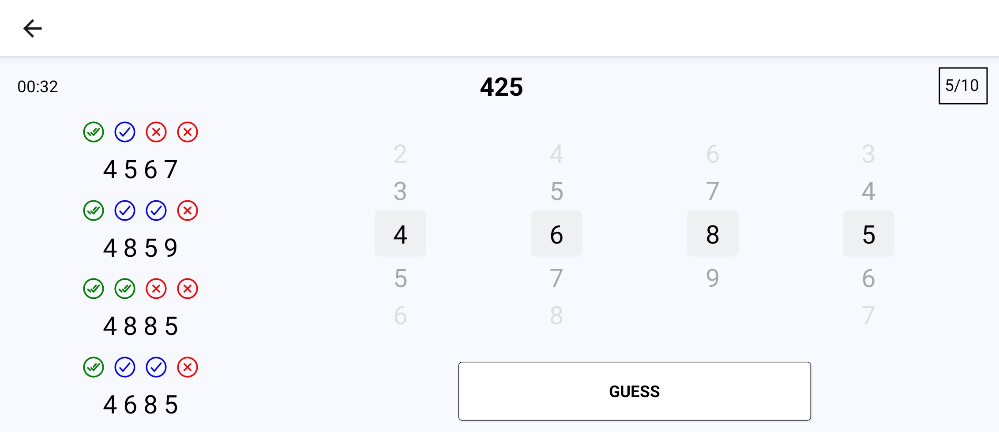

# Abstract

Abstract is a number guessing game.  
This game was made using [React Native](https://reactnative.dev/) and [Expo](https://expo.dev/).  
It was inspired by Abstract (from "The A to Z book of Computer Games" by Thomas C. McIntire) and [Mastermind](https://en.wikipedia.org/wiki/Mastermind_(board_game)).  

## How to play

A random 4-digit number is generated in the beginning of the game. You will have 10 chances to guess the solution.  
After each guess, some clues are presented to show the relative accuracy of each of the digits you provided.  
The clues are presented in a specific order, and **DO NOT** reveal which clue belongs to which digit.  

You can learn more by viewing the in-game "How to play".  

## Installation

Head to the [Releases](https://github.com/ShadowXPA/Abstract/releases/latest) tab and download the latest version available.  
Download the `.apk` that applies to you. If you do not know which CPU architecture you have, you can download the universal apk `Abstract-[VERSION].apk`.  
For `iOS` users, you will have to compile the code yourself (I don't own a mac :) ).  
